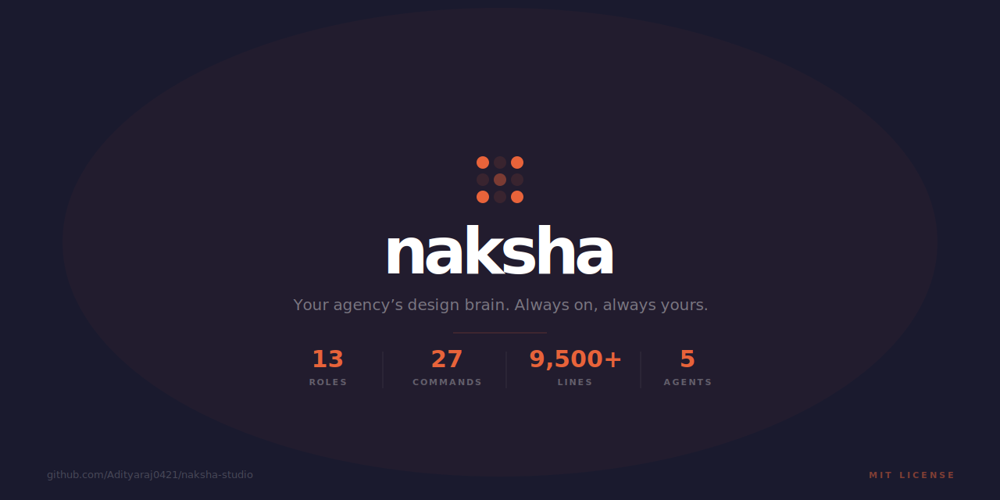
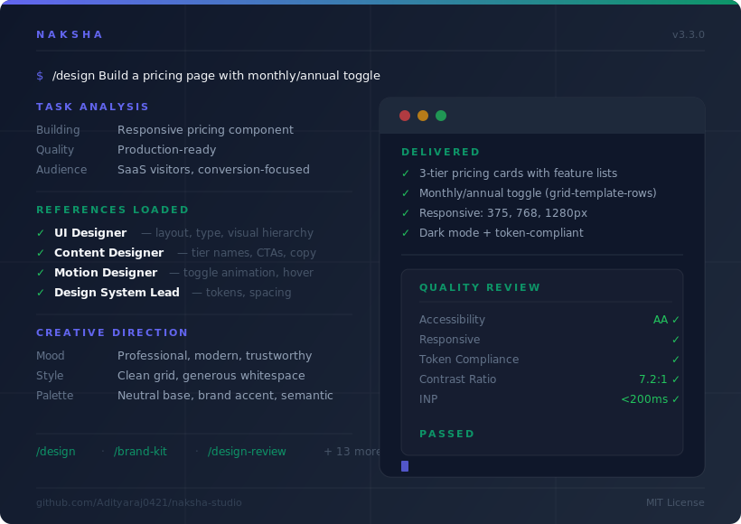
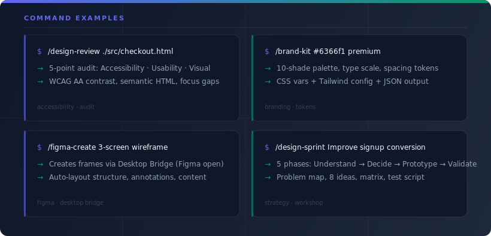
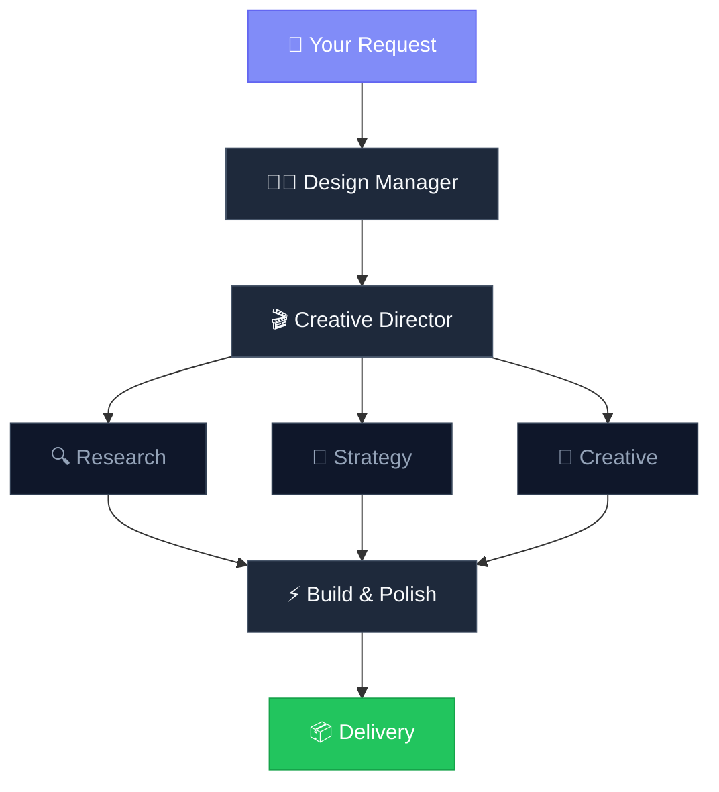

<div align="center">



<br><br>

[](LICENSE)
[](https://claude.ai/claude-code)
[]()
[]()
[]()

**Instead of generic AI design help, Design Studio loads specialized design knowledge for each task — the right expertise activates based on what you're building.**

[Quick Start](#-quick-start) · [Commands](#-commands) · [The Team](#-the-team) · [How It Works](#-how-it-works) · [Changelog](CHANGELOG.md)

</div>

---

## 🚀 Quick Start

```bash
git clone https://github.com/Adityaraj0421/design-studio.git ~/.claude/plugins/design-studio
```

Then try:
```
/design Build a landing page for a SaaS analytics product
```

---

## ⚡ Demo

<div align="center">

</div>

<br>

Running `/design Build a pricing page with monthly/annual toggle` automatically loads UI Designer, Content Designer, Motion Designer, and Design System Lead references — each contributing their specific knowledge to the output. A button redesign loads 1–2 references. A full product feature loads 4–7.

<details>
<summary><b>More examples</b></summary>

<div align="center">

</div>

</details>

---

## 👥 The Team

<table>
<tr>
<td align="center" width="14%">

**Design Manager**

Orchestrates

</td>
<td align="center" width="14%">

**Creative Director**

Vision

</td>
<td align="center" width="14%">

**Product Designer**

Strategy

</td>
<td align="center" width="14%">

**UX Designer**

Flows

</td>
<td align="center" width="14%">

**UI Designer**

Visual

</td>
<td align="center" width="14%">

**UX Researcher**

Insights

</td>
<td align="center" width="14%">

**Content Designer**

Copy

</td>
</tr>
<tr>
<td align="center">

**Design System Lead**

Tokens

</td>
<td align="center">

**Motion Designer**

Animation

</td>
<td align="center">

**Social Media Designer**

Social Visuals

</td>
<td align="center">

**Social Media Strategist**

Campaigns

</td>
<td align="center">

**Social Media Copywriter**

Captions

</td>
<td align="center">

**Growth/Analytics Specialist**

Metrics

</td>
<td align="center">

**Email Designer**

HTML Email

</td>
</tr>
<tr>
<td align="center">

**Email Copywriter**

Subject Lines

</td>
<td align="center">

**Data Viz Designer**

Charts

</td>
<td align="center">

**Dashboard Architect**

Layouts

</td>
</tr>
<tr>
<td align="center" colspan="7">

_The skill loads only the references your task actually needs_

</td>
</tr>
</table>

---

## 🎯 Commands

| Command | What It Does |
|---------|-------------|
| `/design <task>` | Full design workflow with team assembly |
| `/design-review <file>` | 5-point quality audit (accessibility, usability, visual, content, motion) |
| `/design-system` | Generate, extract, or audit design tokens |
| `/figma <URL>` | Convert Figma designs to production code |
| `/figma-create <task>` | Build pages, wireframes, components in Figma |
| `/ux-audit <brief>` | Audit Figma file against a design brief |
| `/design-handoff` | Developer handoff docs (tokens, specs, APIs) |
| `/figma-responsive` | Generate mobile/tablet variants from desktop |
| `/figma-sync` | Detect design–code drift |
| `/design-present` | Interactive HTML presentation from Figma |
| `/brand-kit <color>` | Complete brand kit from 1–2 colors |
| `/component-docs` | Storybook-style docs from Figma components |
| `/figma-prototype` | Prototype connections between frames |
| `/site-to-figma <URL>` | Capture website → editable Figma design |
| `/ab-variants` | A/B test design variants |
| `/design-sprint` | Guided 5-phase design sprint |
| `/social-content <task>` | Social media visuals (posts, stories, reels, carousels) |
| `/social-campaign <brief>` | Campaign planning with strategy, calendar, and captions |
| `/social-analytics <type>` | Social analytics dashboards and performance reports |
| `/design-framework <fw> [file]` | Convert HTML designs to React, Vue, Svelte, Next.js, or Astro |
| `/email-template <type> for <brand>` | Production HTML email template (responsive, dark mode, cross-client) |
| `/email-campaign <type> for <product>` | Complete multi-email campaign sequence with copy and HTML templates |
| `/design-template <category>` | Production web template from gallery (landing-page, dashboard, pricing, auth, blog, ecommerce, portfolio, docs, saas, onboarding) |
| `/chart-design <description>` | Accessible chart or data visualization — selects chart type, applies colorblind-safe palette, outputs HTML/CSS/JS |
| `/dashboard-layout <description>` | Complete dashboard — KPI cards, chart areas, filter bar, data table, sidebar, responsive |

<details>
<summary><b>📖 Command details & examples</b></summary>

<br>

### `/design <task>` — Full Design Workflow

Assembles the right specialists and runs the complete workflow:

```
/design Create a 3-tier pricing page with monthly/annual toggle
/design Redesign the onboarding flow for better conversion
/design Build a real-time analytics dashboard
```

### `/design-review <file>` — Quality Audit

Runs a structured 5-point audit on existing designs:

```
/design-review ./src/pages/checkout.html
```

Checks: Accessibility (WCAG AA) · Usability Heuristics · Visual Consistency · Content Quality · Motion Design

### `/design-system` — Token Generation

Generate, extract, or audit design tokens:

```
/design-system Generate tokens from brand color #2563eb
/design-system Extract tokens from this Figma file
/design-system Audit existing code for hardcoded values
```

### `/figma <URL>` — Figma to Code

Convert Figma designs to production-ready code:

```
/figma https://figma.com/design/abc123/MyApp?node-id=1-2
```

### `/figma-create <task>` — Create Designs in Figma

Build pages, wireframes, components, and design systems directly inside Figma via the Desktop Bridge:

```
/figma-create Build a 3-screen wireframe for a saved content feature
/figma-create Set up a design system with color tokens and type scale
/figma-create Create a component set for Button with 4 variants
```

Requires the [Figma Desktop Bridge](https://www.figma.com/community/plugin/figma-desktop-bridge) plugin running in Figma Desktop.

### `/ux-audit <brief>` — Audit Against a Design Brief

Audit a Figma file for compliance against a design brief — checks page structure, frame naming, sizes, styles, components, and content:

```
/ux-audit Check the Miles UX Design Challenge submission against the brief
/ux-audit Verify all required screens are present at 1440×900
```

### `/design-handoff` — Developer Handoff Docs

Generate a complete developer handoff document from a Figma file — token maps, spacing specs, component APIs, and production-ready code snippets:

```
/design-handoff Generate handoff for the current Figma file
/design-handoff Export tokens as CSS variables and Tailwind config
```

Outputs: Markdown docs, CSS custom properties, Tailwind config, TypeScript types.

### `/figma-responsive <frame>` — Responsive Variants

Generate mobile (375×812) and tablet (768×1024) variants from a desktop Figma frame:

```
/figma-responsive S3-A / Saved Redesigned
/figma-responsive Create mobile and tablet versions of the dashboard
```

Clones the source frame, adapts layout (grid reflow, sidebar collapse, nav simplification), and validates each breakpoint with screenshots.

### `/figma-sync` — Design-Code Sync

Detect drift between Figma designs and code implementation — compare color tokens, typography, spacing, and components:

```
/figma-sync Check if Figma tokens match our Tailwind config
/figma-sync Compare design system styles against CSS custom properties
```

Outputs a sync report with drift score, per-token comparison tables, and optional patches for both Figma and code.

### `/design-present <type>` — Design Presentation

Generate an interactive HTML presentation from Figma screens:

```
/design-present Create a walkthrough presentation of the dashboard screens
/design-present Build a pitch deck from the product mockups
/design-present Generate a case study presentation
```

Features: keyboard navigation, progress bar, annotations, zoom, dark/light mode, fullscreen.

### `/brand-kit <color> [mood]` — Brand Kit Generation

Generate a complete brand kit from 1-2 colors and a mood:

```
/brand-kit #6366f1 premium
/brand-kit Generate a warm brand from #f59e0b
```

Outputs: 10-shade color palettes, secondary/accent colors, type scale, spacing scale, CSS custom properties, Tailwind config, JSON tokens, Figma styles, and a visual HTML reference page.

### `/component-docs` — Component Documentation

Auto-generate Storybook-style documentation from Figma component sets:

```
/component-docs Document all components in the current Figma file
/component-docs Generate docs for the Button component set
```

Outputs: prop tables, variant grids, usage guidelines, code examples (HTML/React), rendered screenshots.

### `/figma-prototype` — Prototype Connections

Create interactive prototype connections between Figma frames:

```
/figma-prototype Connect all screens in the onboarding flow
/figma-prototype Auto-detect buttons and link them to target screens
```

Supports transition presets: slide, dissolve, move-in. Auto-detects interactive elements (buttons, links, nav items, cards).

### `/site-to-figma <URL>` — Website to Figma

Capture a live website and recreate it as an editable Figma design:

```
/site-to-figma https://example.com
/site-to-figma Capture the hero section of stripe.com
```

Extracts color palette, typography, section structure via Playwright, then rebuilds as auto-layout Figma frames with Paint/Text Styles.

### `/ab-variants <frame> [dimension]` — A/B Test Variants

Generate A/B test design variants from an existing Figma screen:

```
/ab-variants Hero Section layout
/ab-variants Pricing Page cta
/ab-variants Landing Page all
```

Creates control + test variants with layout, CTA, copy, or color changes. Includes testing recommendations (sample size, duration, success metrics).

### `/design-sprint <problem>` — Design Sprint

Guided 5-phase design sprint methodology:

```
/design-sprint Improve signup conversion for our SaaS product
/design-sprint Redesign the checkout experience to reduce abandonment
```

Phases: Understand (problem mapping) → Diverge (8 solution ideas) → Decide (weighted matrix) → Prototype (build testable solution) → Validate (test script + success metrics).

### `/design-framework <framework> [file]` — Framework Conversion

Convert HTML/CSS design output to idiomatic component code:

```
/design-framework react-tailwind ./output/landing-page.html
/design-framework vue ./output/dashboard.html
/design-framework nextjs ./src/app/page.html
/design-framework svelte ./output/component.html
/design-framework astro ./output/hero.html
```

Or trigger inline from `/design`:
```
/design Build a pricing page --framework react-tailwind
/design Create an analytics dashboard --framework nextjs
```

Outputs: TypeScript components with proper interfaces, framework-specific patterns (Server/Client components for Next.js, islands for Astro, runes for Svelte 5), design token mapping to Tailwind config or CSS variables, setup instructions.

Supported frameworks: `react-tailwind` · `vue` (Vue 3 + UnoCSS) · `svelte` (Svelte 5) · `nextjs` (App Router) · `astro`

### `/social-content <task>` — Social Media Visuals

Create platform-optimized social media visuals at exact dimensions with safe zones:

```
/social-content Instagram carousel for a product launch — 5 slides
/social-content TikTok story announcing a new feature
/social-content LinkedIn post about our Series A funding
```

### `/social-campaign <brief>` — Campaign Planning

Plan a social media campaign with strategy, content calendar, caption drafts, and KPI targets:

```
/social-campaign Awareness campaign for fitness app targeting Gen Z on Instagram and TikTok
/social-campaign Product launch for SaaS tool — LinkedIn + Twitter — 2 weeks
/social-campaign Engagement campaign for local restaurant on Instagram
```

Outputs: campaign strategy, 2-week content calendar, first-week caption drafts with hooks and CTAs, KPI targets. Visual assets created separately via `/social-content`.

### `/social-analytics <type>` — Social Analytics

Build analytics dashboards, performance reports, or A/B test frameworks:

```
/social-analytics dashboard for Instagram + TikTok — last 30 days
/social-analytics weekly report for LinkedIn company page
/social-analytics ab-test Compare carousel vs. single-image posts on Instagram
```

### `/email-template <type> for <brand>` — HTML Email Template

Generate a production-ready HTML email template with inline styles, table layout, and bulletproof buttons:

```
/email-template welcome for Acme SaaS — new user signup
/email-template promotional for ShopCo — Black Friday 30% off sale
/email-template transactional for OrderCo — order confirmation with item table
/email-template newsletter for TechBlog — weekly curated articles
```

Outputs: Full HTML with VML buttons (Outlook), mobile-responsive `@media` rules, dark mode, preheader, ESP template variables reference, and QA checklist.

### `/design-template <category>` — Template Gallery

Start from a production-ready template for any page type:

```
/design-template landing-page #6366f1
/design-template dashboard --style dark-tech
/design-template pricing --style bold
/design-template saas #2563eb --dark
/design-template portfolio --style minimal
/design-template ecommerce #f59e0b
```

10 categories: `landing-page` · `dashboard` · `pricing` · `auth` · `blog` · `ecommerce` · `portfolio` · `docs` · `saas` · `onboarding`

Outputs: Full responsive HTML/CSS with CSS custom properties for rebrand, semantic markup, vanilla JS interactions, dark mode, and mobile layout.

### `/email-campaign <type> for <product>` — Email Campaign Sequence

Plan and generate a complete multi-email campaign with copy and HTML templates:

```
/email-campaign welcome-series for Figma-clone SaaS — new signups
/email-campaign product-launch for Design Studio v3 — existing users
/email-campaign re-engagement for fitness app — 60-day inactive users
/email-campaign onboarding for project management tool — trial users
```

Outputs: Campaign brief, sequence map with timing, copy for all emails (subject lines, preview text, body, CTAs), full HTML for each email, ESP automation setup notes, A/B test plan.

### `/chart-design <description>` — Chart & Data Visualization

Design any chart with the right chart type, accessible color palette, annotations, and production-ready HTML/CSS/JS:

```
/chart-design monthly revenue trend for 2025
/chart-design part-to-whole breakdown of user acquisition channels
/chart-design scatter plot: ad spend vs conversion rate
/chart-design --library d3 geographic user distribution by US state
```

Applies colorblind-safe palettes (sequential/diverging/categorical), adds contextual annotations, includes ARIA accessibility (role="img", title, desc), responsive tick density, and Chart.js data table fallback. Supports `--library` flag for D3, Recharts, Visx, or vanilla SVG.

### `/dashboard-layout <description>` — Dashboard Layout

Build a complete, production-ready dashboard layout:

```
/dashboard-layout SaaS analytics dashboard with MRR, churn, active users
/dashboard-layout e-commerce admin: orders, revenue, inventory, customer table
/dashboard-layout monitoring dashboard for API performance metrics --style dark-tech
/dashboard-layout --type executive weekly business review for C-suite
```

Outputs full HTML/CSS with sidebar navigation, 4-column KPI card row, primary + secondary chart areas (with `/chart-design` integration hooks), filter bar with date range selectors, sortable data table with pagination, responsive breakpoints (desktop/tablet/mobile), dark mode, and vanilla JS interactions.

</details>

---

## 🔗 Workflows

Commands chain together. Each command suggests relevant next steps:

| Workflow | Pipeline |
|----------|----------|
| Design from scratch | `/design` → `/design-review` → `/design-system` → `/figma-create` |
| Figma-native | `/figma-create` → `/ux-audit` → `/figma-prototype` → `/figma-responsive` |
| Design-to-code | `/figma` → `/design-review` → `/figma-sync` |
| Brand setup | `/brand-kit` → `/figma-create` → `/design-handoff` |
| Stakeholder review | `/figma-create` → `/design-present` → `/ab-variants` |
| Full product sprint | `/design-sprint` → `/figma-create` → `/figma-prototype` → `/design-present` |
| Social media launch | `/social-campaign` → `/social-content` → `/social-analytics` |
| Social content creation | `/brand-kit` → `/social-content` → `/ab-variants` |
| Design-to-React | `/design` → `/design-framework react-tailwind` → `/design-review` |
| Design-to-Next.js | `/design` → `/design-framework nextjs` → `/figma-sync` |
| Email launch sequence | `/brand-kit` → `/email-template` → `/email-campaign` |
| Email + social campaign | `/email-campaign` → `/social-campaign` → `/social-analytics` |
| Template to production | `/design-template` → `/design-framework react-tailwind` → `/design-system` |
| Template to Figma | `/design-template` → `/figma-create` → `/component-docs` |
| Data viz pipeline | `/dashboard-layout` → `/chart-design` → `/design-framework` |
| Full analytics build | `/brand-kit` → `/dashboard-layout` → `/chart-design` → `/design-handoff` |

---

## 🚦 CI/CD Design Checks

Add automatic design quality checks to every PR. The included GitHub Action runs when HTML/CSS files change, posts a score card as a PR comment, and fails CI if quality drops below the threshold.

**Setup:** Copy the workflow to your repo:
```bash
cp .github/workflows/design-check.yml /your-repo/.github/workflows/
cp scripts/design-lint.js /your-repo/scripts/
```

**PR comment example:**
```
✅ Design Quality Check — Score: 94/100

| Severity | File | Check | Issue |
|----------|------|-------|-------|
| 🟡 Warning | src/dashboard.html | CSS token compliance | 7 hardcoded hex colors found |
```

**Local run:**
```bash
node scripts/design-lint.js src/**/*.html src/**/*.css
```

**Configure** via `.design-lint.json` in your repo root (copy from `.design-lint.json.example`):
```json
{ "failThreshold": 80, "ignorePatterns": ["dist/**"] }
```

**Score formula:** `100 − (errors × 10) − (warnings × 3)`

---

## ⚙️ How It Works



**Adaptive loading:** A simple button redesign loads 1–2 references. A full product feature loads 4–7 references with the complete workflow.

---

## 🤖 Agents

| Agent | What It Does | Runs In |
|-------|-------------|---------|
| **accessibility-auditor** | Comprehensive WCAG AA compliance audit with specific code fixes | Background |
| **design-qa** | Visual QA at 3 breakpoints, token compliance scoring, interaction state check | Background |
| **figma-creator** | Creates pages, frames, components, and styles directly in Figma via Desktop Bridge | Foreground |
| **design-critique** | Automated UX heuristic review — Nielsen's 10 heuristics, visual audit, interaction states | Foreground |
| **design-lint** | Scans Figma files for orphan colors, non-standard spacing, low contrast, missing auto-layout | Foreground |

Background agents run in parallel with your main work. Foreground agents run interactively.

---

## 🔍 Auto-Detection

The plugin automatically detects your project context at session start:

| Detects | How |
|---------|-----|
| CSS Framework | Tailwind, PostCSS, Bootstrap |
| JS Framework | React, Vue, Svelte, Next.js, Nuxt, Angular, Astro, Remix, SolidJS |
| TypeScript | `tsconfig.json` |
| Build Tool | Vite, Webpack, Turborepo |
| CSS-in-JS | styled-components, Emotion, vanilla-extract |
| Component Library | Radix UI, Chakra, MUI, Mantine, shadcn/ui |
| Design Tokens | `.tokens.json`, `tokens.css`, Style Dictionary |
| Figma | `.figmarc`, Code Connect files |
| Deployment | `firebase.json` |
| Documentation | `.storybook/` directory |

Recommendations adapt to match your stack — no manual configuration needed.

---

## ⚙️ Configuration

Create `skills/design/settings.local.md` (gitignored) to set defaults:

```yaml
brand_color: "#6366f1"
accent_color: "#f59e0b"
brand_name: "MyProduct"
brand_mood: "professional"

css_framework: "tailwind"
default_font: "Inter"
icon_library: "lucide"

include_dark_mode: true
min_contrast_ratio: 4.5
spacing_base: 8

deploy_target: "firebase"
```

Settings marked `"auto"` or left empty defer to auto-detection. The Design Manager reads these at the start of every task.

---

## 📁 What's Inside

```
design-studio/
├── .claude-plugin/plugin.json          # Plugin manifest (v2.1.1)
├── skills/design/
│   ├── SKILL.md                        # Design Manager orchestration
│   ├── settings.local.md              # User-configurable preferences
│   └── references/
│       ├── product-designer.md         # End-to-end UX, feature scoping
│       ├── ux-designer.md              # Flows, wireframes, IA
│       ├── ui-designer.md              # Color, typography, layout, components
│       ├── ux-researcher.md            # Heuristics, accessibility, edge cases
│       ├── content-designer.md         # Microcopy, errors, tone of voice
│       ├── design-system-lead.md       # 3-tier tokens, theming, dark mode, Figma styles
│       ├── motion-designer.md          # Timing, easing, micro-interactions
│       ├── figma-workflow.md           # Figma MCP tools, design-to-code + creation
│       ├── figma-creation.md           # Figma API patterns via Desktop Bridge
│       └── deployment.md              # Preview server, Firebase Hosting
├── commands/                           # 20 slash commands
├── agents/                             # 5 specialist agents
├── hooks/hooks.json                    # SessionStart + PreToolUse + Stop hooks
├── scripts/
│   ├── detect-design-context.sh        # Project stack detection
│   └── run-evals.sh                    # Eval structure validator
├── evals/
│   ├── evals.json                      # 17 eval cases (prompt + assertion specs)
│   └── fixtures/test-page.html         # Fixture: landing page with a11y issues
├── assets/                             # Social preview + demo images
├── CHANGELOG.md                       # Version history
└── CONTRIBUTING.md                    # Contributor guide
```

<details>
<summary><b>Design knowledge breakdown (8,500+ raw lines)</b></summary>

| File | Lines | Covers |
|------|-------|--------|
| **figma-creation.md** | **693** | **Figma Desktop Bridge API, async patterns, auto-layout, component sets, paint/text styles, variables, wireframe patterns, annotations, screenshot validation** |
| design-system-lead.md | 427 | 3-tier tokens, theming, dark mode, Figma paint/text style creation, component sets |
| motion-designer.md | 360 | Timing, easing functions, transitions, micro-interactions, reduced motion |
| **design-lint.md** | **335** | **6 lint rule categories, orphan colors, contrast, non-standard spacing, auto-layout quality, component hygiene, scored reports** |
| **design-sprint.md** | **327** | **5-phase sprint: Understand, Diverge, Decide, Prototype, Validate — problem framing, ideation, decision matrix, test plans** |
| **site-to-figma.md** | **310** | **Website capture via Playwright, style extraction, Figma recreation as auto-layout frames with Paint/Text Styles** |
| **brand-kit.md** | **301** | **HSL shade generation, secondary color derivation, type scale, spacing scale, CSS/Tailwind/JSON/Figma outputs** |
| **figma-responsive.md** | **298** | **Responsive variant generation, layout analysis, breakpoint adaptation, grid reflow, sidebar collapse** |
| **design-handoff.md** | **278** | **Developer handoff docs, token maps, spacing specs, component APIs, CSS/Tailwind/TypeScript exports** |
| SKILL.md | 300 | Design Manager orchestration, team assembly, workflow phases, output formats |
| **design-critique.md** | **263** | **UX heuristic review, Nielsen's 10 heuristics, visual audit, interaction states, critique reporting** |
| **component-docs.md** | **262** | **Auto-generated Storybook-style docs, prop tables, variant grids, usage guidelines, code examples** |
| **figma-prototype.md** | **258** | **Prototype connections, interactive element detection, transition presets, flow specification** |
| **figma-sync.md** | **252** | **Design-code drift detection, token comparison, typography/spacing sync, patch generation** |
| **ab-variants.md** | **248** | **A/B test variant generation, layout/CTA/copy/color changes, testing recommendations** |
| figma-workflow.md | 246 | Figma MCP tools, design-to-code, Figma-native creation workflow |
| ui-designer.md | 243 | Color theory, type scale, grid, components, responsive patterns |
| ux-designer.md | 239 | User flows, IA, wireframing, interaction design, usability |
| **design-present.md** | **233** | **Interactive HTML presentations, keyboard nav, annotations, walkthrough/pitch/case-study types** |
| content-designer.md | 229 | Microcopy, error formulas, empty states, tone, number formatting |
| ux-audit.md | 219 | Figma file compliance auditing, brief parsing, structural/style/component checks |
| ux-researcher.md | 207 | Nielsen's heuristics, WCAG AA checklist, mental models, edge cases |
| deployment.md | 198 | Preview server, Firebase Hosting, image/CSS/font optimization |
| figma-create.md | 150 | Create designs in Figma command — pages, wireframes, components, design systems |
| figma-creator.md | 142 | Figma creation specialist agent — layout building, component creation, validation |
| design.md (command) | 107 | Full design workflow — team assembly, creative direction, implementation, quality review |
| figma.md (command) | 108 | Figma-to-code workflow — analysis, layout mapping, comparison, refinement |
| design-review.md (cmd) | 89 | 5-point quality audit — accessibility, usability, visual, content, motion |
| design-system.md (cmd) | 84 | Token generation, extraction, auditing — CSS variables, Tailwind, JSON |
| product-designer.md | 140 | Feature scoping, user outcomes, business alignment, design patterns |
| design-qa.md | 127 | Visual QA at 3 breakpoints, token compliance, interaction states |
| accessibility-auditor.md | 105 | WCAG AA compliance, color contrast, semantic HTML, keyboard nav |

</details>

---

## 🛠 Tech Stack Defaults

| Category | Default | Why |
|----------|---------|-----|
| Styling | Tailwind CSS | Utility-first, rapid iteration |
| Icons | Lucide | Clean, consistent, tree-shakeable |
| Fonts | Inter | Optimized for UI, great readability |
| Charts | Chart.js / SVG | Lightweight, no heavy deps |
| Animations | CSS transitions | No JS libraries for simple motion |
| Preview | Claude Preview MCP | Live results in your editor |
| Deployment | Firebase Hosting | One-command deploy |

All defaults adapt when the plugin detects your project uses a different stack.

---

## 📦 Installation

```bash
git clone https://github.com/Adityaraj0421/design-studio.git ~/.claude/plugins/design-studio
```

Restart Claude Code to load the plugin.

---

## Requirements

- [Claude Code](https://claude.ai/claude-code) CLI
- **Optional MCP servers** for Figma + Preview capabilities — see [MCP Setup Guide](MCP-SETUP.md)

---

<div align="center">

**Built with Claude Code**

[Report Issues](https://github.com/Adityaraj0421/design-studio/issues) · [Changelog](CHANGELOG.md) · [MIT License](LICENSE)

</div>
